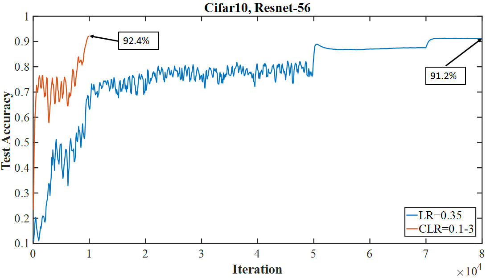

## Intro

Scott Mueller

###### smueller.tampa.ai@gmail.com

---
## Tampa.ai

Looking for Presenters

---
## Finding State of the Art Techniques through Open Competitions

https://meanderingstream.github.io/competitions_state_of_art
---
## A disciplined approach to neural network hyper-parameters: Part 1 – learning rate, batch size, momentum, and weight decay

https://arxiv.org/abs/1803.09820

---
## Remembering Lessons Learned

* Super Convergence
* Unreasonable Effectiveness of Validation/Test Loss

*High Learning Rate -> Regulator*

---
## High Learning Rate

---
## Difference In Model Performance Seen Early

---
## Example of How Learning Rate Makes Difference

---
## Competition With Unusual Criteria

* Accessible - Commercial single GPU Computers

* Difficult Problem but Low Nbr Images

* Best in X Epoch

* Publish How - Repeatability

---
## Epoch Constrained

* 5, 20, 80, 200

*Learn From Random Weights*

https://www.fast.ai/2020/01/13/self_supervised/
---
## Researchers Did Too Well

* Let's make it harder

* 70/30 train/valid
- older had smaller validation set

---
## Imagenette

* 10 Easy to Classify Images

* tench, English springer, cassette player, chain saw, church, French horn, garbage truck, gas pump, golf ball, parachute

* Pulled from Imagenet
---
## Imagenette Leaderboard

---
## Imagewoof

* 10 Not so Easy to Classify Images

* Australian terrier, Border terrier, Samoyed, Beagle, Shih-Tzu, English foxhound, Rhodesian ridgeback, Dingo, Golden retriever, Old English sheepdog

* Pulled from Imagenet
---
## Imagewoof Leaderboard

---
## Example Notebook

https://github.com/muellerzr/Practical-Deep-Learning-For-Coders/blob/master/02b_SOTA.ipynb

[SOTA](./nbs/Practical-Deep-Learning-For-Coders_02b_SOTA.ipynb.pdf)

---
## Imagewang

* Imagenette and Imagewoof

* Twist: Make into Semi-supervised problem

* Validation is same as Imagewoof - No Imagenette

* Only 10% of Imagewoof are in training set
---
## Imagewang Leaderboard

* Beginning of competition, no leaderboard

https://www.fast.ai/2020/01/13/self_supervised/

[Self Supervised](./nbs/Selfsupervised_fastai.pdf)

---
Questions?

---

[KnowFalls.com](https://www.KnowFalls.com/)

Fall Prevention Focus

###### scottmueller@knowfalls.com
